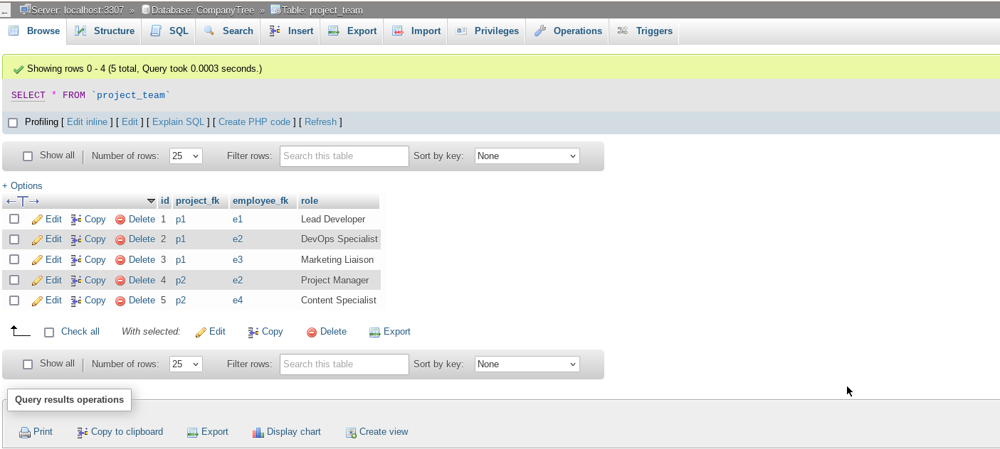

# XML to MySQL Database Mapping

## Overview

This Python script main.py is designed to parse XML data from company.xml and map it into a MySQL database. It creates tables for departments, employees, projects, and project teams, then inserts data from the XML file into these tables.


## Database Schema


## All Tables


## Table departments


## Tables employees


## Tables projects


## Tables project_team



## Requirements
- Python 3.x
- MySQL Server
- pip package manager

## Installation

### 1. Clone the repository

```bash
 git clone https://github.com/putra-asmarjoe/CompanyTree.git
 cd CompanyTree
```

### 2. Install dependencies

```bash
pip install -r requirements.txt
```

### 3. Set up database
#### Create the MySQL database `CompanyTree` and grant necessary permissions to the user specified in your .env file (MYSQL_USER).


### 4. Set up environment variables
#### Create a `.env` file in the root directory with the following variables:

```makefile
MYSQL_HOST=localhost
MYSQL_PORT=3306
MYSQL_USER=root
MYSQL_PASSWORD=password
MYSQL_DATABASE=CompanyTree
```
##### Make sure to adjust MYSQL_USER and MYSQL_PASSWORD to match your MySQL credentials.

## Usage

### Manual

The script will connect to the MySQL database, create necessary tables if they do not exist, insert data from company.xml, and commit the transaction.

```bash
python main.py
```

### Run with Docker Compose
 #### Alternatively, you can use Docker Compose to run in a single command:
 ```bash
 docker-compose -f docker-compose.yml up -d --build
 ```

## License

This project is licensed under the MIT License. See the [LICENSE](LICENSE) file for details.
